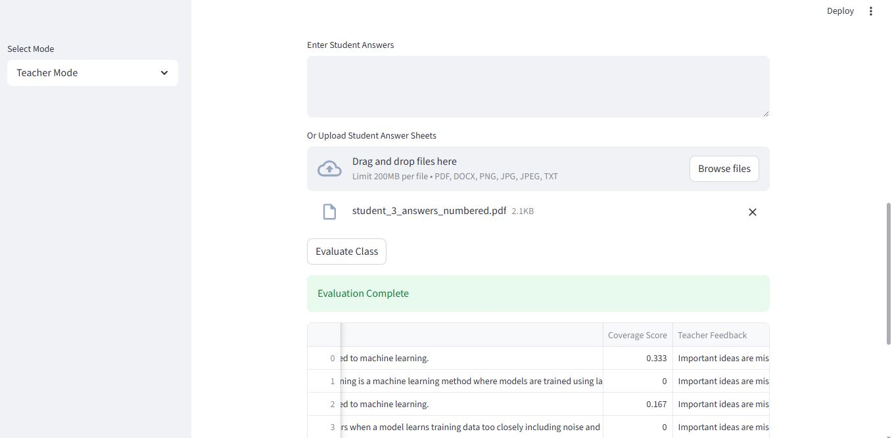
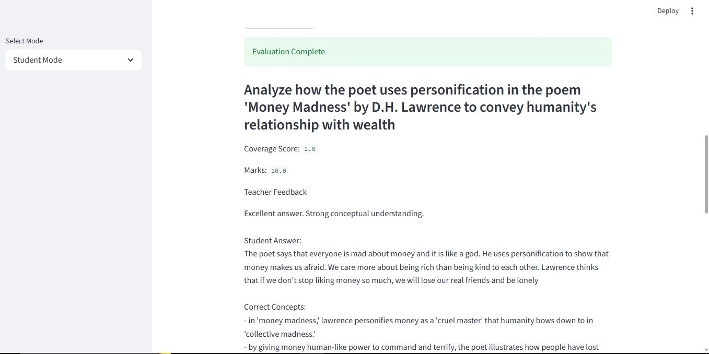

# Intelligent Feedback Engine

![Intelligent Feedback Engine Header]

## Overview

The **Intelligent Feedback Engine** is an advanced AI-powered grading and feedback system tailored for educators and students. By automating the evaluation of student answer sheets—including handwritten ones scanned via OCR—the platform minimizes manual grading efforts while providing transparent, comprehensive feedback powered by a hybrid SBERT-RAG (Retrieval-Augmented Generation) pipeline.

Whether you're a teacher batch-grading submissions for a whole classroom or a student looking for individual actionable insights into your answers, this engine provides a seamless, dynamic, and structured interface.

## Key Features

### 👩‍🏫 Teacher Mode
- **Batch Processing**: Evaluate multiple student answer sheets simultaneously.
- **Class Insights & Analysis**: Auto-generate a high-level summary and analytical report of the entire classroom’s performance based on the evaluated responses.
- **Automated Score Generation**: Calculates scores intelligently taking into account the semantic completeness of the given answers.
- **Export Results**: Download the grading report as a simple `.csv` file.

### 🧑‍🎓 Student Mode
- **Individual Grading**: Submit an answer string or document for immediate feedback.
- **Coverage & Concept Scoring**: Provides precise semantic-based grading instead of simplistic keyword matching.
- **Teacher Feedback & Enhanced AI Feedback**: Pinpoints exact areas of missing context and generates actionable AI resources for learning improvement.

### ⚙️ Core Technical Capabilities
- **OCR Support (EasyOCR)**: Built-in integration with `EasyOCR` to effectively extract text from scanned, handwritten student submissions.
- **Auto Answer Key Generation (Fallback Engine)**: Incorporates a robust fallback mechanism using Generative AI (Groq). If an answer key is seamlessly omitted by the user, the system will intelligently auto-generate a model answer to ensure evaluations can still proceed without interruption.
- **Advanced NLP Pipelines**: Employs `sentence-transformers` for calculating semantic textual similarity and handling brevity penalties for unfairly short answers.

## Showcase / Screenshots

### Teacher Mode Interface

*Teacher Mode provides a comprehensive view for batch uploading student answers and generating robust classroom insights.*

### Student Mode Interface

*Student Mode individually evaluates the student's answer against the expected Answer Key and returns multi-tier feedback.*

## Tech Stack

- **Frontend / Interface**: [Streamlit](https://streamlit.io/)
- **Optical Character Recognition (OCR)**: [EasyOCR](https://github.com/JaidedAI/EasyOCR), OpenCV, pdf2image, Pillow
- **Machine Learning & NLP**: `sentence-transformers` (SBERT), Scikit-Learn, NLTK
- **Generative AI / LLM**: Groq API
- **Data Engineering**: Pandas, NumPy
- **Document Parsers**: `pdfplumber`, `python-docx`

## Setup & Installation

Follow these steps to run the Intelligent Feedback Engine on your local machine.

### Prerequisites
- Python 3.8 or higher.
- A valid **Groq API Key** (Set as an environment variable `GROQ_API_KEY`).

### Installation

1. **Clone the repository**
   ```sh
   git clone <your-github-repo-url>
   cd mini_easyocr
   ```

2. **Create a virtual environment (Recommended)**
   ```sh
   python -m venv venv
   source venv/bin/activate  # On Windows use: venv\Scripts\activate
   ```

3. **Install Dependencies**
   ```sh
   pip install -r requirements.txt
   ```

4. **Run the Application**
   ```sh
   streamlit run app.py
   ```

## Usage Instructions

1. Start the application locally using Streamlit.
2. Ensure you have your `GROQ_API_KEY` exported in your terminal session or added to a `.env` file if implementing `python-dotenv`.
3. Choose the Mode from the sidebar:
   - Select **Teacher Mode** to drop multiple student answer files (PDF, DOCX, images) alongside a question paper/answer key. 
   - Select **Student Mode** to evaluate a single answer and get deep, structured feedback.
4. Click **Evaluate** and explore the final scores, feedback, and class insights!

## Known Limitations & Hardware Requirements

- **Resource Intensive OCR**: While the system fully supports Optical Character Recognition via `EasyOCR` for handwritten and scanned text, please be advised that processing high-resolution, real-world exam sheets is extremely resource-intensive. Running these deep learning pipelines on standard consumer hardware—particularly environments with limited RAM and no dedicated GPU—can lead to "Out of Memory" (OOM) exceptions. For extensive, real-world educational usage, professional deployment on a cloud server with dedicated AI accelerators is highly recommended.

## Future Scope

- **Cloud / GPU Optimization**: Transitioning the OCR pipeline to a dedicated cloud architecture or building a scalable microservice that relies securely on GPUs to manage compute-intensive grading workflows reliably.
- **Advanced Handwritten Paper Analysis**: Fine-tuning computer vision and OCR pipelines to more accurately and efficiently handle complex, real-world handwritten exam sheets with messy or idiosyncratic handwriting, significantly reducing memory overhead.
- **Multilingual Support**: Extending text recognition and semantic evaluation capabilities to accommodate multiple languages beyond English.
- **Improved UI and Analytics**: Adding richer data visualizations (e.g., interactive dashboard graphs for teacher insights) to track classroom and individual student progress over term periods.
- **Direct LMS Integration**: Seamlessly integrating the feedback engine directly into educational platforms like Moodle, Canvas, or Blackboard.

## Contributors
*Feel free to fork the repository and submit pull requests. For major changes, please open an issue first to discuss what you would like to change.*

